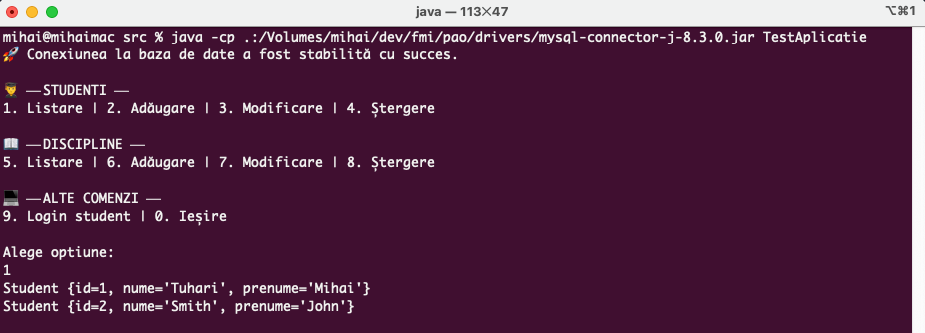

# fmi-pao
Proiect la disciplina "Programare avansată pe obiecte" – an II ID @ FMI

### Condiții obligatorii de evaluare a proiectelor
- să nu prezinte erori de compilare
- să respecte cerințele precizate mai jos

### Arhitectura aplicației:
- să fie definite cel puțin 6 acțiuni pe care să efectueze aplicația
- să fie utilizate cel puțin 6 clase

### Tema aleasa
Catalog (Student, Disciplină, Profesor, Facultate)

### Implementarea aplicației în Java
<details open>
  <summary>1. Clasele vor avea date membre private / protected și metode publice de acces</summary>

Implementat in toate clasele. Exemplu [`ModelPersoana`](./src/Modele/ModelPersoana.java)
</details>

<details open>
  <summary>2. Cel puțin într-o clasă se vor rescrie metode din clasa `Object`</summary>

Metoda `toString` din [`ModelPersoana`](./src/Modele/ModelPersoana.java)
</details>

<details open>
  <summary>3. Se vor utiliza cel puțin două colecții diferite capabile să gestioneze
   obiectele definite anterior, iar cel puțin una trebuie să fie sortată</summary>

- `List<>` folosit in mai multe clase
- `TreeSet` folosit in [`ServiciuCatalog`](./src/Servicii/ServiciuCatalog.java) pentru [`Disciplina`](./src/Modele/Disciplina.java) ce implementeaza `Comparable` 
</details>


<details open>
    <summary>4. Se va utiliza moștenirea pentru crearea de clase specializate</summary>

- [`ModelBaza`](./src/Modele/ModelBaza.java) este parintele tuturor claselor (management id)
- [`ModelPersoana`](./src/Modele/ModelPersoana.java) extins the [`Student`](./src/Modele/Student.java) si [`Profesor`](./src/Modele/Profesor.java) (management nume, prenume)
</details>

<details open>
    <summary>5. Cel puțin într-o clasă se va utiliza agregarea sau compoziția</summary>

In clasa [`Facultate`](./src/Modele/Facultate.java) se foloseste agregarea pentru a avea o lista de discipline si studenti
</details>

<details open>
    <summary>6. Se va implementa un serviciu de autentificare</summary>

Implementat [`ServiciuAutentificare`](./src/Servicii/ServiciuAutentificare.java) pentru login. Verifica email & parola din baza de date.
</details>

<details open>
    <summary>7. Se va implementa cel puțin o clasă serviciu care sa expună acțiunile care
   pot fi efectuate de aplicație</summary>

Clasa [`ServiciuCatalog`](./src/Servicii/ServiciuCatalog.java) expune actiuni ce pot fi efectuate de aplicație
</details>

<details open>
    <summary>8. Se va implementa o clasă Test care să permită rularea aplicației prin intermediul
   unui meniu de tip text (se poate utiliza și o interfață grafică)</summary>

Implementat prin intermediul [`TestAplicatie`](./src/TestAplicatie.java).


</details>

<details open>
    <summary>9. Se va asigura persistența datelor utilizând o bază de date relațională și JDBC</summary>
- StudentDAO pentru CRUD
</details>

<details open>
    <summary>10. Se vor realiza servicii care sa expună operații de tip CRUD (Create, Read, Update și Delete)
    pentru cel puțin una dintre clasele utilizate</summary>

- Clasa `ServiciuCatalog` expune operatii de tip CRUD pentru modele
</details>

<details open>
    <summary>11. Se va implementa un serviciu care să înregistreze într-un fișier de tip CSV fiecare
    executare a uneia dintre acțiunile aplicației, sub forma denumire_acțiune, data_și_ora</summary>
- `ServiciuLogging`
</details>


### Notite
```
java -cp .:/Volumes/mihai/dev/fmi/pao/drivers/mysql-connector-j-8.3.0.jar TestAplicatie
```
